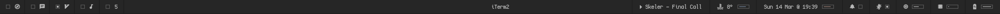

# yabar
> 📊 Slim Übersicht status bar made for yabai.

## Dependencies
- [calm-notifications](https://github.com/vitorgalvao/tiny-scripts/blob/master/calm-notifications) <sup>(do not disturb support)</sup>

## Installation
```
git clone https://github.com/strafe/yabar $HOME/Library/Application\ Support/Übersicht/widgets/yabar
```

## Preview
<center></center>

## Credits
Inspiration and code from both [simple-bar](https://github.com/Jean-Tinland/simple-bar) and [nero](https://github.com/lucaorio/nero).

## LICENSE
[MIT](LICENSE)
